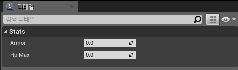
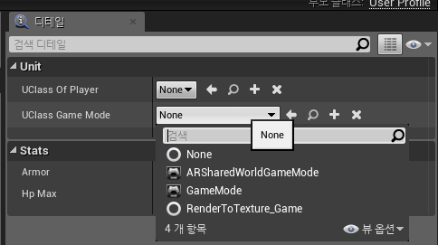
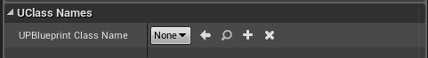
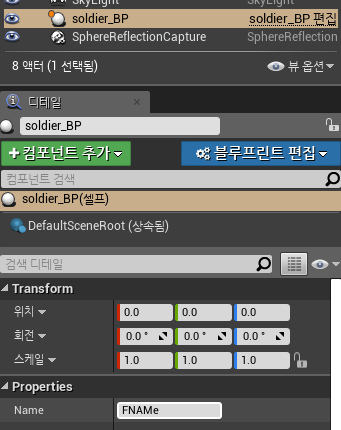

# 2장_ 클래스 생성하기

Subject: C++로 개발하는 언리얼엔진  
기한: Aug 05, 2019  


# 1. 클래스 생성하기

## 1. `UCLASS`


일반적인 클래스의 한 단계 위(graduated)을 **UCLASS**라 칭한다.  
이 UCLASS 매크로를 잘 작성하면 **블루프린트가 가능한 UCLASS**를 작성하는 게 가능하다.

블루프린트가 가능한 UCLASS를 만드는 이점은 텍스트 필드, 슬라이더 및 모델 선택 박스같은  
**편리한 UI 위젯을 사용해 사용자 정의 C++ 객체가 블루프린트들이 시각적으로 편집 가능한  
속성(UPROPERTY)을 가질 수 있다**는 것이다.

사용자 정의 C++ 객체를 UCLASS로 선언해 UE4 클래스처럼 동작하는 사용자 정의  
C++ 클래스를 선언할 수 있다. 이럴 경우 **UCLASS는 스마트 포인터 규칙**에 의해  
메모리 할당과 해제관련된 메모리관리 루틴를 사용하고, 에디터에서 로드되고 읽을 수 있으며  
블루프린트에서 마음대로 접근할 수 있다.

> **스마트 포인터가 마음에 든다면 UCLASS가 더 안전한 코드를 만들 뿐 아니라  
전체 코드베이스를 더욱 응집력 있고 일관되게 만든다.**

### 1-1. `UCLASS` 구동원리

    // Fill out your copyright notice in the Description page of Project Settings.
    
    #pragma once
    
    #include "CoreMinimal.h"
    #include "UObject/NoExportTypes.h"
    #include "UserProfile.generated.h" // UCLASSNAME.generated.h가 맨 마지막에!
    
    /**
     * 
     */
    UCLASS()
    class BASICSTUDY_API UUserProfile : public UObject
    {
    	GENERATED_BODY()
    	
    };

위처럼 `UCLASSNAME.generated.h` 가 가장 마지막에 `#include` 되어야 한다!

### 1-2. `UCLASS` 동작 방식 수정 방법

- `Blueprintable`

    UE4 에디터상 Class Viewer에서 블루프린트를 만들 수 있다는 의미.  

    

- `BLueprintType`

    이 키워드를 사용한 UCLASS를 다른 블루프린트에서 변수로 사용할 수 있다.  
    `NotBLueprintType`을 지정하면 블루프린트 다이어그램에서 변수로 사용할 수 없다.  
    Class Viewer에서 블루프린트 클래스 생성이 표시되지 않는다.

## 2. 사용자 편집 가능한 `UPROPERTY` 만들기


`UCLASS`마다 여러 개의 `UPROPERTY`가 선언될 수 있다.

    // Fill out your copyright notice in the Description page of Project Settings.
    
    #pragma once
    
    #include "CoreMinimal.h"
    #include "UObject/NoExportTypes.h"
    #include "UserProfile.generated.h"
    
    /**
     * 
     */
    UCLASS(Blueprintable) // Blueprintable 추가
    class BASICSTUDY_API UUserProfile : public UObject
    {
    	GENERATED_BODY()
    	
    
    public:
    	UPROPERTY(EditAnywhere, BlueprintReadWrite, Category = Stats)
    	float Armor;
    
    	UPROPERTY(EditAnywhere, BlueprintReadWrite, Category = Stats)
    	float HpMax;
    };



위와같이 `UPROPERTY` 매크로를 이용하면 UE4 에디터 내에서 직접 값을 수정하고 적용할 수 있다.

### 2-1. `UPROPERTY` 구동원리


`UPROPERTY()` 매크로에 저장된 매개변수들은 변수와 관련된 몇 가지 중요한 정보를 지정한다.

- `EditAnywhere
UPROPERTY()` 매크로는 블루프린트에서 직접 편집하거나 게임 레벨에 배치된 UCLASS 객체의 각 인스턴스를 편집할 수 있다.
    - `EditDefaultsOnly`
    블루프린트 값은 편집 가능하나 인스턴스마다는 불가능하다.
    - `EditInstanceOnly`
    기본 블루프린트에서는 안 되지만 게임 레벨에서 UCLASS 객체 인스턴스의
    UPROPERTY() 매크로에 대해 수정할 수 있다.

- `BlueprintReadWrite` **(Public 맴버 변수만 가능)**
블루프린트 다이어그램에서 읽기 쓰기가 가능한 속성을 말한다.
    - `BlueprintReadOnly` 
    이 프로퍼티는 C++에서 설정되어야 하고 블루프린트에서는 읽기만 가능하다.

- `Category`
이 카테고리는 속성 에디터에서 UPROPERTY()가 나타날 하위 메뉴를 보여준다.

## 3. 블루프린트에서 `UPROPERTY` 접근하기


블루프린트 다이어그램에서 접근하기 원하는 변수를 UPROPERTY로 노출시켜야한다.

(`BlueprintReadWrite`, `BlueprintReadOnly` 등을 사용해서)

    // Fill out your copyright notice in the Description page of Project Settings.
    
    #pragma once
    
    #include "CoreMinimal.h"
    #include "UObject/NoExportTypes.h"
    #include "UserProfile.generated.h"
    
    /**
     * 
     */
    UCLASS(Blueprintable, BlueprintType) // 추가
    class BASICSTUDY_API UUserProfile : public UObject
    {
    	GENERATED_BODY()
    	
    
    public:
    	UPROPERTY(EditAnywhere, BlueprintReadWrite, Category = Stats)
    	float Armor;
    
    	UPROPERTY(EditAnywhere, BlueprintReadWrite, Category = Stats)
    	float HpMax;
    
    	UPROPERTY(EditAnywhere, BLueprintReadWrite, Category = Stats)
    	FString Name; // 추가
    };

블루프린트 다이어그램에서 UCLASS 타입으로 사용하려면 UCLASS 매크로의  
BlueprintType 선언이 필요하다.

### 3-1. 구동원리


UE4클래스에서 `UPROPERTY`는 **자동적으로 Get/Set 메소드가 작성**된다.  
publie 혹은 protected 멤버 변수가 아닌 데 선언하면 컴파일 에러가 뜬다!

    >> BlueprintReadWrite should not be used on private members.

## 4. UPROPERTY 타입으로 UCLASS 작성하기


UE4에서 객체들은 참조 횟수 및 메모리 관리 대상이어서 C++ 키워드 new를 사용한  
직접 메모리 할당은 안된다.  
대신 UObject에서 파생된 것들은 ConstructObject 함수로 인스턴트화 해야한다.

C++ 코드는 구체적인 UCLASS 이름을 알지 못한다.  
**컴파일 후에만 접근할 수 있도록 에디터에서만 편집하기 때문**이다.  
하지만, 어떻게 하든 C++ 코드로 인스턴스화하기 위해 블루프린트 클래스 이름을  
알려줘야 하지 않겠는가?

우리는 사용가능한 모든 블루프린트를 나열하는 메뉴를 만들어  
C++ 코드가 사용할 UCLASS를 지정하도록 하는 것이다.  
이는 `TSubclassOf<C++ 클래스 이름>` 타입 변수로 사용자 편집 가능한 `UPROPERTY` 를 제공하면 된다.  
혹은 `FStringClassReference`를 사용해도 된다.

### 4-1. 구동방법


    UCLASS()
    class BASICSTUDY_API UUserProfile : public UObject
    {
    	GENERATED_BODY()
    	
    
    public:
    
    	UPROPERTY(EditAnywhere, BlueprintReadWrite, Category = Unit)
    	TSubclassOf<UObject> UClassOfPlayer;
    
    	UPROPERTY(EditAnywhere, meta=(MetaClass="GameMode"), Category = Unit)
    	FStringClassReference UClassGameMode;
    
    };



### 4-2. 구동 원리


**`TSubclassOf`**

TSubclassOf<> 멤버 변수는 이 멤버 변수들을 가진 블루프린트를 편집할 때  
UE4 에디터의 드롭다운 메뉴를 사용해 UClass 이름을 정할 수 있다.  

`FSoftClassPath` (FStringClassReference에서 변경)

이 메타클래스 태그는 UClassName이 파생될 것으로 예상되는 C++ 기본 클래스를 참조한다.  
그러면 드롭다운 메뉴의 내용이 해당 C++ 클래스에서 파생된 블루프린트로만 한정된다.  
프로젝트에서 모든 블루프린트를 표시하려면 메타클래스 태그를 그냥 둘 수 있다.

## 5. UObject 파생 클래스 인스턴스화하기


C++에서 클래스 인스턴스를 만드는 것은 전통적으로 new 키워드를 사용했지만,  
UE4의 UObject 파생 클래스를 생성할 때는 **특별한 UE4 엔진 함수를 사용**해  
클래스를 인스턴스화 해야한다.

**UCLASS 인스턴스를 제대로 인스턴스화하고자 할 때 필요한 두 가지**

- 인스턴스화하려는 클래스 타입에 대한 C++ 타입 UClass 참조 (블루프린트 클래스)  
- 블루프린트 클래스로 파생된 원래 C++ 기본 클래스  

### 5-1. 구동 방법


    UPROPERTY(EditAnywhere, BlueprintReadWrite, Category = "UClassNames")
    TSubclassOf<UUserProfile> UPBlueprintClassName;



**NewObject** 함수를 사용하고자 할 경우

    UProfile* object = NewObject<UProfile>( GetTransientPackage(), uclassReference );

## 6. UObject 파생 클래스 파괴하기


UObject 파생 클래스를 지울 준비가 되었을 때, 함수(`ConditionalBeginDestroy()` )를 호출하여  
해체를 시작한다.

UObject 파생 객체에 C++ delete 키워드를 사용하지 않는다.  

### 6-1. 구동방법


1. 오브젝트 인스턴스에서 `objectInstance->ConditionalBeginDestroy()` 를 호출한다.  
2. 클라이언트 코드에서 objectInstance에 대한 참조들을 null처리한다.  
ConditionalBeginDestroy()가 호출된 후에 objectInstance를 사용하지 않는다.

### 6-2. 구동원리


`ConditionalBeginDestroy()` 함수는 모두 내부 엔진 연결을 제거해 파괴하기 시작한다.  
내부 속성들을 삭제하는데 조금 시간이 걸리고 이어서 실제 객체가 파괴된다.

실제 메모리 회수는 객체에서 `ConditionalBeginDestroy()`가 호출됐을 때보다 늦게 된다.  
언리얼 엔진의 가비지 컬렉션 루틴이 60초마다 수집하기 때문이다.

## 7. UENUM() 만들기


UE4에서는 UENUM()이라는 사용자 정의 열거형이 있다.

이 열거형을 사용하면 블루프린트에서 편집 가능한 드롭다운 메뉴를 만들 수 있다.

### 7-1. 구동 방법


1. 지정한 `UENUM()`을 사용할 헤더 파일로 이동하거나 `EnumName.h` 파일을 만든다.
2. 다음 코드를 사용한다.
```
    UENUM()
    enum Status
    {
    	Stopped			UMETA(DisplayName = "Stopped"),
    	Moving			UMETA(DisplayName = "Moving"),
    	Attacking		UMETA(DisplayName = "Attacking")
    };
   ```

3. `UCLASS()`에서 다음처럼 `UENUM()`을 사용한다.
```
    UPROPERTY(EditAnywhere, BlueprintReadWrite, Category = Status)
    	TEnumAsByte<Status> status;
```


## 8. UFUNCTION 만들기


UFUNCTION은 C++ 클라이언트 코드와 블루프린트 다이어그램 모두에서 호출할 수 있는  
C++ 함수이기에 유용하다. 모든 C++함수는 `UFUNCTION()`으로 표시될 수 있다.

### 8-1. 구동 방법


1. 블루프린트에 공개할 멤버 함수로 UClass를 만든다.  
`UFUNCTION(BlueprintCallable, Category=SomeCategory)` 를 사용해 해당 멤버 함수를
블루프린트에서 호출 가능하도록 한다.
2. 게임 월드 상에서 인스턴스를 드래깅해 클래스 인스턴스를 만든다.
3. 블루프린트에서 해당 함수 `ToString()`을 호출한다.
```
    // 예시 코드
    
    // soldier.h
    UFUNCTION(BlueprintCallable, Category = "Properties")
    FString ToString();
    
    
    // soldier.cpp
    FString Asoldier::ToString()
    {
    	return FString::Printf(TEXT("An instance of UProfile : %s"), *Name);
    }
```
